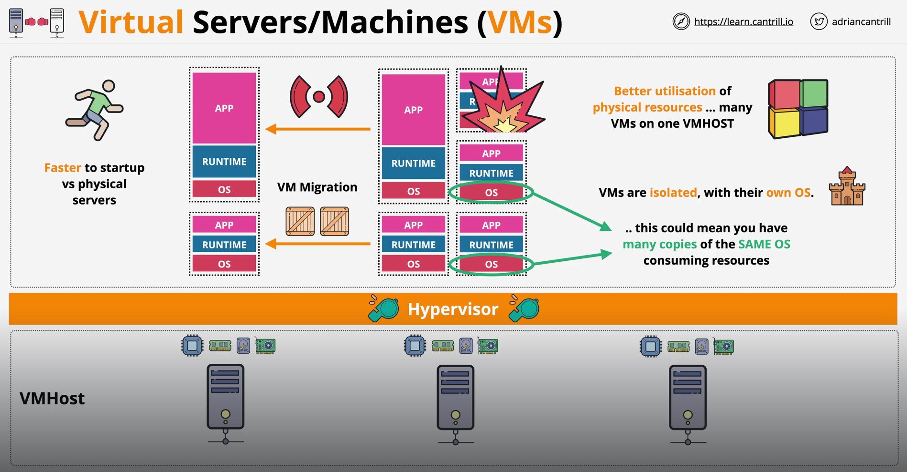

Physical servers and virtual machines (VMs) serve similar functions but differ significantly in how they operate and the flexibility they offer.

# PHYSICAL SERVERS

A physical server is a dedicated piece of hardware, or a single machine, that runs one or more applications and operating systems directly on its own hardware.

Resources like CPU, memory, and storage are fixed and dedicated to the server’s tasks.

Generally, physical servers offer higher performance because they have direct access to hardware resources without any abstraction layers.

Scaling often requires purchasing and setting up additional physical servers, which can be costly and time-consuming.

Managing and maintaining physical servers can be more labor-intensive, as each server requires individual attention for updates, monitoring, and troubleshooting.

Physical servers can have higher upfront costs due to hardware purchase, installation, and maintenance needs, and they consume more physical space and power.

When a physical server experiences hardware failure (e.g., disk, CPU, or memory failure), it can bring down the entire server along with all applications running on it. Since there’s no abstraction layer, the applications and OS on the server lose direct access to hardware resources, making recovery challenging and often requiring manual intervention.

Physical server failure can lead to significant downtime. Since applications rely on a single hardware setup, recovery involves replacing hardware components, reconfiguring systems, and restoring data from backups if needed.

Recovery from physical server failure is usually more complex and time-consuming due to the need for hands-on hardware troubleshooting, component replacement, and OS reinstallation or backup restoration.

# VIRTUAL SERVERS / VIRTUAL MACHINES (VMs)

A virtual machine is a software-based emulation of a physical computer that runs on a "hypervisor", a layer that enables multiple VMs to share the same physical server hardware.

Resources are allocated through the "hypervisor", which manages the distribution of CPU, memory, and storage among multiple VMs, allowing flexible scaling based on demand.

VMs can experience slight performance overhead due to the virtualization layer, but modern hypervisors minimize this.

Scaling is easier with VMs, as they can be created or cloned quickly on existing hardware, and new instances can be spun up without the need for physical setup.

VMs offer centralized management through virtualization platforms, simplifying backups, recovery, and resource monitoring. VMs can be moved between physical servers for load balancing.

VMs reduce hardware costs since multiple VMs can run on a single physical server. They save on physical space and power and are more flexible in allocating resources based on the application's current needs.

Since VMs are software instances that run on a hypervisor, they aren’t directly affected by the physical hardware of the server in the same way as applications on a physical server. If a single VM fails (e.g., due to a software crash or OS issue), other VMs on the same physical server are usually unaffected. However, if the physical server hosting the VMs fails, all VMs on that server go down simultaneously.

VM downtime can be minimal if hosted on a robust virtualization platform with failover capabilities. Many platforms allow VMs to be restarted automatically on another server in the event of hardware failure.

VMs can be recovered more easily than physical servers. They are portable, meaning they can often be moved to another server within the same environment. Virtualization platforms often support live migration, enabling VMs to be transferred between physical hosts without noticeable downtime.

Mmultiple physical servers, each with its own hypervisor, can be clustered together within a virtualization platform, forming a "cluster" or "resource pool" under a centralized management system. This setup allows the hypervisors on separate physical hosts to work together, enabling VM migration, load balancing, and high availability across multiple servers.

Since each VM will be running its own copy of the OS, it means there might be some wasting of resources because each copy of the OS needs its own resources to run. For example, if you're running 50 copies of the same OS, then you are wasting a lot of resources due to this duplication. And this wastage due to replication of the OS is what "containers" fix.