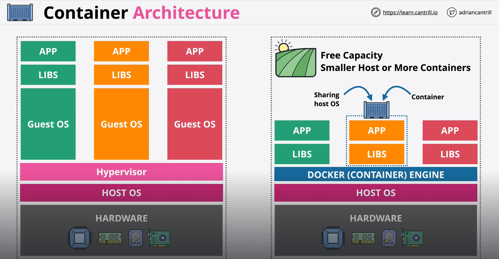

When it comes to containers, we start with the same physical hardware, which we call the "Container Host". On top of this, we have the "Host OS". Then on top of it, we have a "Container Engine". In case of "Docker", we have the "Docker Engine". Compared to a "Hypervisor", a "Container Engine" us much lighter because it has less to do.

The biggest difference between the VMs and Containers is that any Containers running on a specific "Container Host" share the same Host OS. This means, those Containers run as a "process" of that Host OS. This is the biggest differnce because as we know, in case of VMs, each VM runnin on a VMHost has its own copy of the OS.

And for this reason, we say that VMs are isolated on "OS-level", whereas the Containers are isolated on "Process-level".

Containers are highly resource-efficient since they do not require a separate OS instance; they only contain the application and its dependencies, sharing the host OS kernel. This lightweight nature allows more applications to run on the same physical hardware compared to VMs, reducing waste and improving density.

When it comes to "Statup Time", VMs take longer to boot because each one starts its own OS instance. But, Containers start almost instantly because they do not boot a full OS, they only need the application and its dependencies to start.

This makes container engines ideal for microservices, rapid scaling, and high-demand environments where quick deployment and scaling are needed.

Containers run consistently regardless of the underlying hardware or OS, enabling a “build once, run anywhere” approach that enhances flexibility and portability.

Ofcourse not eveything is perfect. Container isolation is at the process level rather than the OS level, making it easier for a compromised container to affect others on the same host. Just imagine some container consuming a lot of the memory and CPU. This might impact other containers on that "Container Host".

Also, Since containers share the host OS kernel, any vulnerability in the kernel could potentially affect all containers running on that host. This is less secure than the isolation VMs offer, where each VM has its own OS.

# WHY CONTAINERS ARE NEEDED

Here is a good way to understand the need of "Containers" -

They were created to fix the "Application Shipping" problem where applications worked in the development environment but failed to function as expected in staging or production due to differences in system configurations, OS versions, installed libraries, and dependencies.

So, when we say "It works on my computer", "Containers" are a way to say "ok, let's ship your computer".

Containers encapsulate an application along with all of its dependencies (libraries, binaries, configuration files). This ensures that the application will run the same way regardless of where it is deployed—whether in development, staging, or production environments.

Since containers package the application and its environment together, they eliminate the "works on my machine" problem, where an application might work fine on a developer's machine but fail when deployed elsewhere.

Containers are platform-independent. You can package an application in a container and run it on any system that supports containerization (e.g., Docker, Kubernetes), regardless of the underlying OS, provided the container runtime (like Docker) is installed.

Containers are lightweight, and they can be started or stopped in seconds. This reduces the time required for deploying applications to various environments and allows for continuous integration and continuous deployment (CI/CD) practices to be implemented more effectively.

Because containers are so fast to spin up and tear down, developers can run their applications in a production-like environment locally and confidently ship the same environment to production without worrying about discrepancies.

Containers enable the versioning of both applications and their environment. With container images, you can easily track changes, roll back to previous versions, or create new versions for testing new features or configurations. This allows teams to manage and ship not only the application code but also the environment in which it runs.