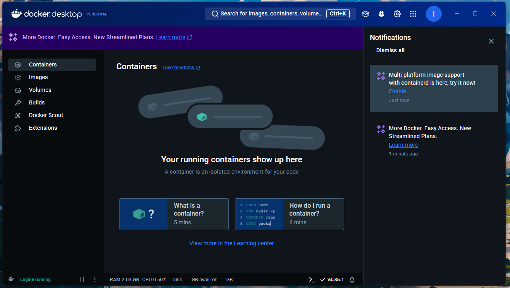

Alright then, it's time to get started with "Docker".

Docker is a platform for developing, shipping, and running applications inside containers. It simplifies the process of building, testing, and deploying applications by providing a consistent environment across different systems and stages of the development lifecycle.

Let's see the simplest way to install docker which is using "Docker Desktop". 

Docker Desktop is a software application that provides a graphical user interface (GUI) and tools to work with Docker on a local machine, typically on Windows and macOS. It allows developers to easily manage Docker containers, images, and other Docker resources on their personal computer, without needing to set up a complex environment manually.

Here is the official webpage to download "Docker Desktop" - https://www.docker.com/products/docker-desktop/

Just download the correct version as per your operating system and then install it. You might have to restart your PC to finish the installation.

Once you install it, you might see a Service Agreement popup. Just Accept it and Finish the Installation. You can also create a new account on Docker and use it in "Docker Destop"software.

And finally, you will see the above screen when the software finishes installing properly and starts for the first time.

One more thing you should do is open command prompt or terminal and type "docker" and press enter. If there are no errors, then you can be sure that Docker is installed properly.

You can run "docker version" to see the version installed on your system, along with some other information as shown in the above screenshot.