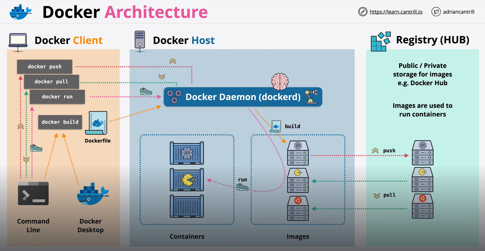

Docker's architecture consists of several key components that work together to create, manage, and run containers efficiently. 

# DOCKER HOST

The "physical" or "virtual" machine in which "Docker" is installed is known as the "Docker Host". It serves as the environment for running Docker components, such as the Docker daemon, images, and containers.

# DOCKER DAEMON (dockerd)

This is like the "brain" of the entire Docker architecture. It is responsible for managing Docker objects (like images, containers, networks, and volumes).

The daemon listens to API requests and performs container management tasks, such as starting, stopping, and scaling containers. Who makes those API requests? Well, you can make those requests using a simple Command Line or using "Docker Desktop". Or you can have your own applications that communicate with "Docker Daemon" directly.

The daemon can interact with other Docker daemons to manage Docker services in a cluster, like with "Docker Swarm".

If you think of Docker as a client-server architecture, then "Docker Daemon" will be the "Server". Similarly, the "Docker Desktop" will be like the "Client" in this case.

On the Docker Host, under the control of "Docker Daemon", there are two main things - Containers & Images.

## DOCKER IMAGES

A Docker image is a read-only template with instructions for creating a container. Images include everything needed to run an application, such as the code, runtime, libraries, environment variables, and config files.

Docker images are built in layers using a file called a "Dockerfile". Each line in the "Dockerfile" represents a layer in the final image, allowing for better caching and reuse.

Images are stored in registries (like Docker Hub) and can be pulled from these to be used locally.

## DOCKER CONTAINERS

A container is a runnable instance of a Docker image. It includes everything needed to execute the application and is isolated from other containers and the host.

Containers share the OS kernel of the host system but run in their isolated environments (namespaces), ensuring security and resource allocation control (via cgroups).

Containers can be created, started, stopped, moved, or deleted as needed.

Docker Containers are like Docker Images only but instead of being just "Read-only", the "Docker Containers" are "Read-Write" enabled. So, some data can be stored on that Docker Container and then we can run that Docker Container on that Docket Host.

# DOCKER CLI

The Docker command-line interface (CLI) enables users to interact with the Docker daemon. Common commands include "docker run", "docker build", "docker pull", and "docker push".

The Docker client communicates with the Docker daemon via REST API, sending instructions and receiving responses.

# DOCKER REGISTRY (HUB)

A registry is a storage for Docker images. "Docker Hub" is the default public registry, but private registries are also supported.

Users can push images to a registry for storage and pull them from there to create containers on different hosts or environments.

To pull the images, we need to run the "docker pull" command from the Docker Client (CLI or Docker Desktop) an then this will send a request to the "Docker Daemon", which in turn will pull those images from the "Docker Registry" to the "Docker Host".

If we want to create our own images, we have to use the "docker build" command. As an input, this command takes a "Dockerfile" as input. What is a "Dockerfile"?

# DOCKERFILE

A Dockerfile is a text file with a series of instructions used to create a Docker image.

It defines the environment and steps needed to build and run a containerized application, including the application’s dependencies, configuration, and any files it needs.

Using a Dockerfile, you can automate the process of creating consistent, reproducible images, which can then be shared and deployed on any Docker Host.

Once you have one or more images running on the Docker Host, you can use the "docker run" command and the "Docker Daemon" will use this command to run Docker Containers using the images.

You can also push the images to the Docker Registry (Public or Private) using "docker push" command.

# DOCKER NETWORKS

Docker provides networking options (like bridge, host, overlay) to enable containers to communicate with each other, with other Docker hosts, and with external networks.

Containers can be connected to specific networks, providing isolation or shared networking as needed.

# DOCKER VOLUMES

Volumes are used for persistent data storage. Unlike containers, data in volumes isn’t removed when the container is stopped, making it suitable for database storage, logs, and other persistent data.

# DOCKER COMPOSE

Docker Compose is a tool for defining and managing multi-container Docker applications. With "docker-compose.yml" files, users can specify container configurations and orchestrate complex environments with ease.

# SUMMARY OF DOCKER WORKFLOW

1. A user writes a Dockerfile to define the image.
   
2. The Docker client uses the CLI to build the image, sending commands to the Docker daemon.
   
3. The Docker daemon builds the image and stores it locally or pushes it to a registry.
   
4. Containers are then created from images and managed by the Docker daemon.