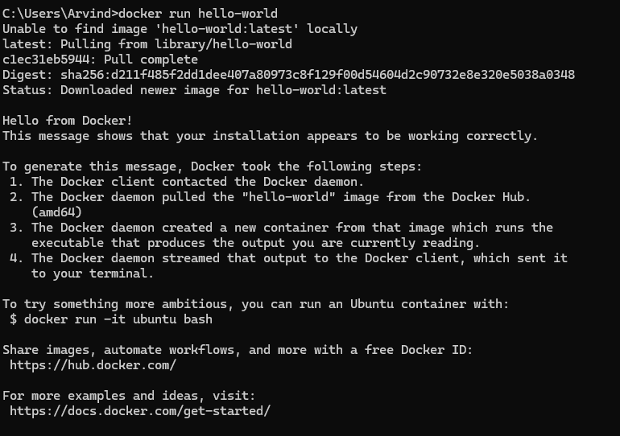

Let's try to run a container using Docker Command-line Interface (CLI).

So, as we discussed in previous section, we first have to download a docker image from the registry.

First, make sure Docker Desktop is running because if it is stopped, that also stops the Docker Engine. We want the "Docker Engine" to be up and running so that we can execute Docker commands in the CLI.

To see a list of containers currently running on the Docker Host, you can run this command - 

    docker ps

You will see that it shows there are no containers currently running.

Similarly, if we want to see if there are any Docker Images on the Docker Host, we can run -

    docker images

Again, you will see that it shows no images if you haven't pulled or created any.

Let's run a simple container named "hello-world". You might argue that we don't have any such container which is right. But, if Docker does not find one in our local system, it will try to pull the image from the registry.

    docker run hello-world
    
As we can see in the image above, as soon as we run this command, the first thing we see in terminal is -

    Unable to find image 'hello-world:latest' locally

So, Docker first checks whether the "hello-world" image is available in your local image repository (cache) on the Docker Host.

The next line is - 

    latest: Pulling from library/hello-world

Since the image is not found locally, Docker connects to "Docker Hub" and pulls the latest version of the hello-world image from there.

This process involves downloading all necessary layers of the hello-world image, which may include multiple files, depending on the image’s dependencies.

    c1ec31eb5944: Pull complete
    Digest: sha256:d211f485f2dd1dee407a80973c8f129f00d54604d2c90732e8e320e5038a0348
    Status: Downloaded newer image for hello-world:latest

Once the download is complete, Docker stores the image in your local image repository for future use.

Then, "Docker Daemon" will create a new container from this downloaded image and it will generate the rest of the text you will see in the terminal - 

    Hello from Docker!
    This message shows that your installation appears to be working correctly.

Ofcourse you can also pull the image separately using "docker pull" command and then run a container using "docker run". But, if you just run "docker run" on its own and you don't have a relevant image, then it will pull the image from the Registry.

If you run "docker ps", it will again show no containers. Now, you may argue but we just ran a container, right? Well, the "docker ps" command by default shows "running" containers. Our "hello-world" container ran and then its job finished so it stopped. That's why we don't see it when we run "docker ps".

But, if we also want to see the stopped containers, then we can write -

    docker ps -a

Here "-a" means "all" so it will list all the containers, including those that are stopped, exited or created but not started.