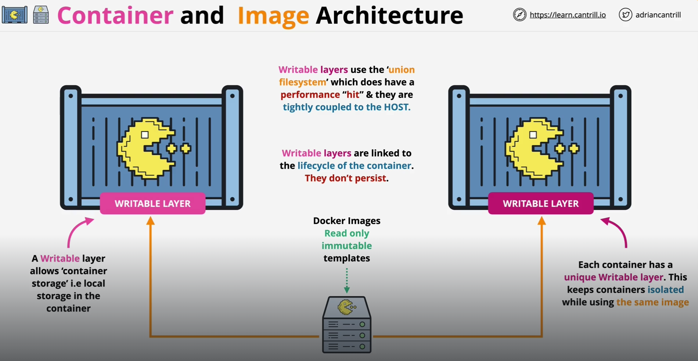
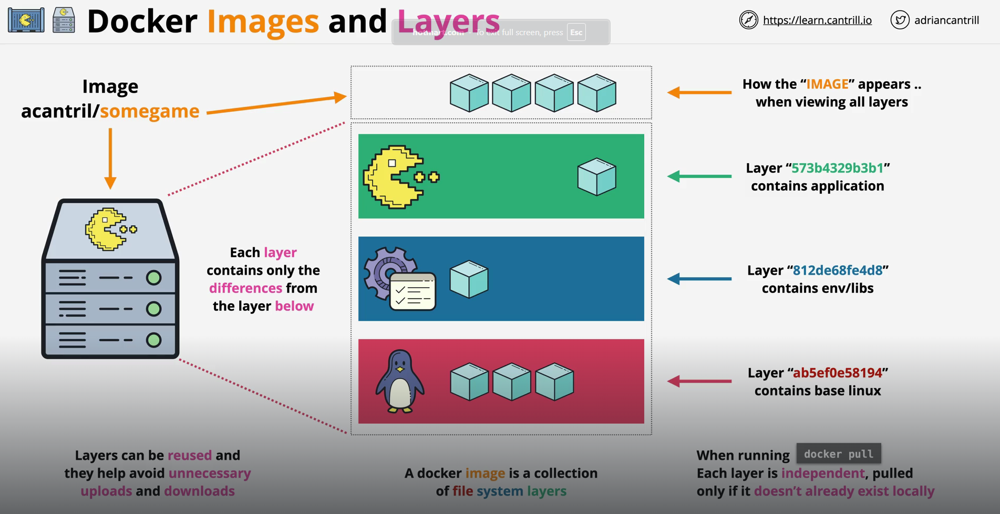

A "Docker Image" can be thought of a "Read-Only" and "Immutable" template. You cannot change an image after you created one. If you do so, instead of changing it, a new image will be created.

But since we know that Containers are created from the images themselves, what happens with the data in that container? How is it saved somewhere if we know images are immutable?

Well, a new "Writable" layer is added to the "Container" which allows "Container Storage" i.e, local storage in the container. So,all the data writes happen inside the container instead of changing the image itself.

And this "Writable Layer" is what makes one container unique from the other container, even if both of them are based off the same image.

The "Writable layer" (also known as the container layer or overlay layer) is the topmost layer of a Docker container’s filesystem. It’s where all changes made to the container’s file system during its runtime are stored. This layer is created when a container is started, and it exists only as long as the container is running. When the container is deleted, the writable layer is also removed, meaning any data or changes made to this layer are lost unless they're stored in a volume or bind mount.

The "Writable" layers use the "Union Filesystem" which does have a performance hit and they are tightly coupled to the host.

When we say that writable layers have a "union file system," it refers to a way of handling files across multiple layers so that they appear as a single, unified file system. Here is a breakdown of what "Union File System" means -

Containers use a layered filesystem, where each layer is either read-only (typically the image layers) or writable (a special container layer added at runtime). The union file system combines these layers so that the files from each layer appear as if they’re in one cohesive file system.

When a container runs, a writable layer is added on top of the stack of read-only layers. This writable layer is where any changes to files (like modifications, deletions, or additions) take place. The original read-only layers remain unchanged; only the writable layer captures changes.

If a file in a read-only layer needs to be modified, it is "copied up" to the writable layer. The union file system then directs reads and writes to the updated file in the writable layer, leaving the original file in the lower layer untouched.

Using a union file system allows containers to share common layers between instances. Since only the writable layer needs to be unique per container, storage usage is minimized, and startup times are faster.

# DOCKER IMAGES AND LAYERS

Each Docker image is composed of multiple layers stacked on top of each other to form the complete image. Layers in a Docker image are read-only. When a container is created from an image, Docker adds a writable layer on top of the read-only layers to allow changes without altering the original image.

Layers are shared across images whenever possible. For instance, if two images are based on the same OS, they can share the OS layer, saving disk space and reducing duplication.

Docker caches each layer, so when rebuilding an image, Docker can reuse existing layers if they haven’t changed. This significantly speeds up builds, especially for images with many dependencies.

Each layer is isolated from the others, which is part of what gives Docker its portability. A specific layer, like a base OS, can be reused across many images, ensuring consistency and reducing maintenance.

In image above, let's take an example of a simple game server image. It might have three layers where the bottom layer contains the base linux file system layer. So, it has all the files required to boot a linux container.

The middle layer has some runtime environment files and libraries which the application needs.

The topmost layer has the application.

Each of these is a separate layer but when working with images, the Docker Container simply sees one single store of data containing all the data from the independent layers.