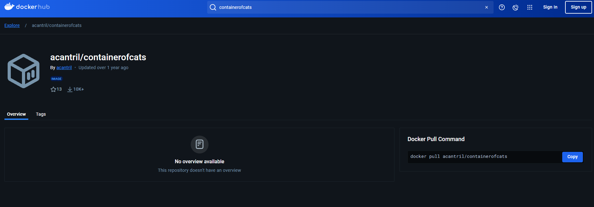
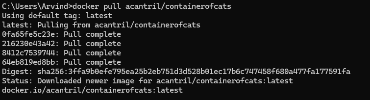
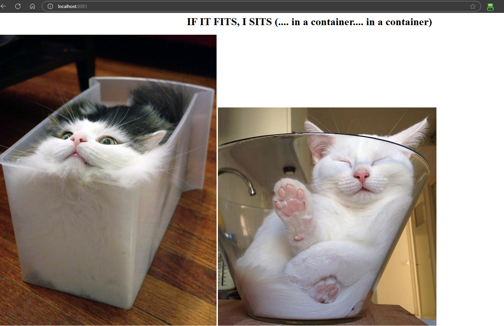
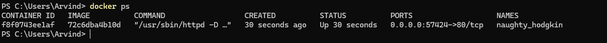
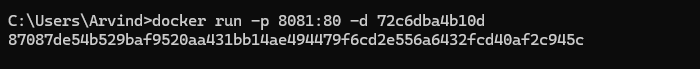
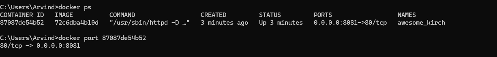
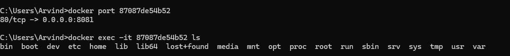
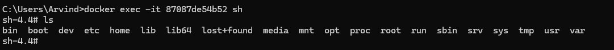

Let's try to download an image from the "Docker Hub".

There is an image named "containerofcats" by "acantril" which we are going to download.

You can go to the "Docker Hub" webpage and search the image by its name -> https://hub.docker.com/

This is the image we are talking about -> https://hub.docker.com/r/acantril/containerofcats

As the page shows, we can use the following command to pull the image -

    docker pull acantril/containerofcats

So, lets run the command in the terminal and as we will see, this "Docker Image" has more than one layers so it will Pull all of them and then it will show that it downloaded the image.

Now, you can see this Docker Image in your Docker Host using -

    docker images

It will show this image and it will have a unique "image id" that we will be using now.

One thing we can do with a Docker Image is to see the metadata associated with it. And we do that using "docker inspect" command -

    docker inspect 72c6dba4b10d

Note that here, "72c6dba4b10d" is the image id of the image that we pulled. It will be different in your case. And once you run the command, you will see a ton of information about that image displayed in the terminal such as the date when it was created, Docker Version with which it was created, Author, Architecture, OS, Size, and so on.

Now, let's run a container using this docker image. Now, instead of "image id", we can also use the "image name" in most of the commands. One of such commands is "docker run" so we can also pass the name of the Docker Image to this command instead of the Image Id.

# -p FLAG

Now, we are going to use a new flag with "docker run" command that we have not used before and it is "-p".

The "-p" flag in the "docker run" command is used to publish or map a container's internal ports to ports on the host machine, allowing you to access the containerized application from outside the container.

This is the syntax - 

    docker run -p <host_port>:<container_port> <image>

Here, "host_port" is the "port" on the host machine (in our case, it is the port on our system) that you want to bind to.

The "container_port" is the port on which the containerized application is listening.

In our case, the image is configured such that it is listening to port "80". So, we want to bind a port on our host machine to the port 80 of the container.

And so, we write -

    docker run -p 8081:80 72c6dba4b10d

What this enables us to do now is to access the application that is running on the container by visiting -

    http://localhost:8081

Once you run the command above, you might see the following message in the terminal -

    AH00558: httpd: Could not reliably determine the server's fully qualified domain name, using 172.17.0.2. Set the 'ServerName' directive globally to suppress this message

Ignore that. Now, we can go to our browser and visit "http://localhost:8081" to see the running application.

It is also worth mentioning that if you do not specify any "host_port" using the "-p" command and you just specify the "container_port" like this -

    docker run -p 80 72c6dba4b10d

Even in this case, the application will run and in this case, Docker will automatically assign a random host port.

If you want to know what port Docker assigned for this container, just run this command in a new terminal -

    docker ps

It will show the running container, along with the port number in the "PORTS" column.

In our case, it is "57424" so we can visit "localhost:57424" to access the application.

What if we did not specify the "-p" flag at all?

    docker run 72c6dba4b10d

In this case, the container will still run but we won't be able to access the running application inside the container from our system. The container’s ports will only be accessible from within the container or from other containers in the same Docker network.

So it means, in case we do not need external access to the application, we should not be using "-p" flag. Maybe we want to use the container's services internally, such as in a private network with other containers (in Docker Compose, for instance).

# -d FLAG

So far, we have seen that when we run "docker run" in our terminal, it will run a new Container but that will be attached to the terminal which means if you exit the terminal or stop the terminal, it will also stop the container.

There is a flag which we can use if we want to avoid this. It is the "-d" or the "detached mode" flag.

When you use this flag, Docker runs the container in the background and returns the command prompt to you immediately, rather than attaching to the container's standard output (stdout) and keeping it open in the terminal.

So, we can keep using the terminal after we have started the container and the container will run in the background that is useful for services such as the web servers or databases.

We will see that as soon as we run the "docker run" command with "-d" flag, it immediately returns the terminal to us so we can write run commands or simply exit the terminal.

The hashed value you see when you run "docker run -d <image>" is the container ID. This unique identifier is assigned by Docker to each running container, and it allows you to reference or manage that specific container.

# docker port COMMAND

There is another way to see the port on which a specific container is running and that is using the "docker port" command. We just need to pass the "container id" to this command which we can easily get using the "docker ps" command.

So, when we run the command, it will give us the output as shown in the image above. This is the output - 
    
    80/tcp -> 0.0.0.0:8081

It simply means that the port "80" of the container is mapped to the port "8081" of our system.

# docker exec COMMAND

The docker exec command allows you to run a command inside a running Docker container. This is useful for interacting with a container after it’s already running, such as accessing a shell, inspecting files, or running additional commands.

This is the syntax -

    docker exec [options] <container_id> <command>

Usually as an option, we pass "-it" where -

    -i keeps the STDIN open to allow interactive commands.
    -t allocates a pseudo-TTY, making the session interactive.

So, in our case, the container id is "87087de54b52" so we can write the following command if we want to list the files in the container -

    docker exec -it 87087de54b52 ls

Let's try to run a shell inside the docker container using "sh" command -

    docker exec -it 87087de54b52 sh

And boom! Now we are running a shell inside the "Docker Container" from our terminal. To exit from the shell you can run "exit" command.

# docker logs COMMAND

The docker logs command allows you to view the logs generated by a running or stopped container. This command is useful for monitoring application output, debugging issues, or reviewing container activity over time.

    docker logs 87087de54b52

If we want the timestamps of the logs to display as well, we can use "-t" flag -

    docker logs -t 87087de54b52

Maybe we want to keep the log data open so as the new logs come, they are displayed in the terminal. In this case, we can use the "-f" flag.

    docker logs -t -f 87087de54b52

This is useful for monitoring logs in real-time as they are generated.

If we need only specific number of entries, we can use the "--tail" flag and pass a number. Let's say we want only the last 3 log lines, we can write -

    docker logs -t --tail 3 87087de54b52

Maybe we want the logs generated in last 20 minutes. We can use the "--since" flag -

    docker logs -t --since 20m 87087de54b52

# OTHER COMMANDS

You can "restart" a container using the "docker restart" command -

    docker restart 87087de54b52

You can "stop" a container using the "docker stop" command -

    docker stop 87087de54b52

You can "start" a container using the "docker start" command - 

    docker start 87087de54b52

You might think that docker "start" and docker "restart" are doing the same thing.

But, the "docker start" command is used to start a stopped container. It resumes the container "without resetting or stopping any processes" that might have been running before. It only starts containers that are currently stopped. If the container is already running, this command won’t have any effect.

If we want to "resume" a container that was previously stopped but we do not need to reset it, we should use "docker start" command.

Talking about "docker restart", it first stops the container, then starts it again. This will interrupt any running processes and reset the container’s runtime environment.

It is useful when you want to refresh the container’s state, such as when it encounters an error or needs a configuration reload that can’t be applied dynamically.

To remove a container from our Docker Host, we can simply run "docker rm" command and pass it the container id -

    docker rm 87087de54b52

To remove an image, we can run "docker rmi" command and pass it the image id -

    docker rmi 72c6dba4b10d 

Note that you can pass multiple container and image ids to the "rm" and "rmi" commands to download more than one containers or images at once.
