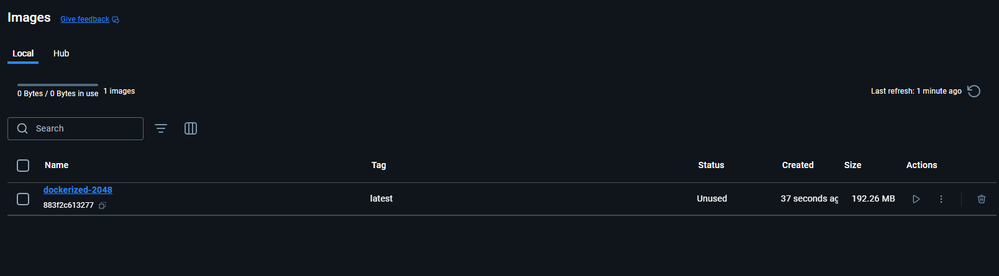
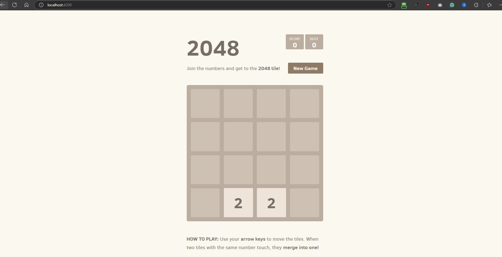
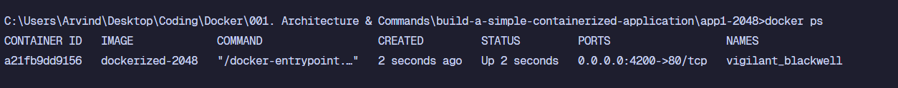
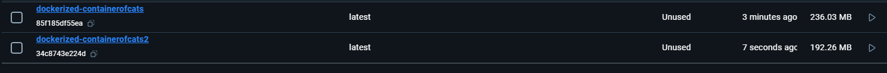
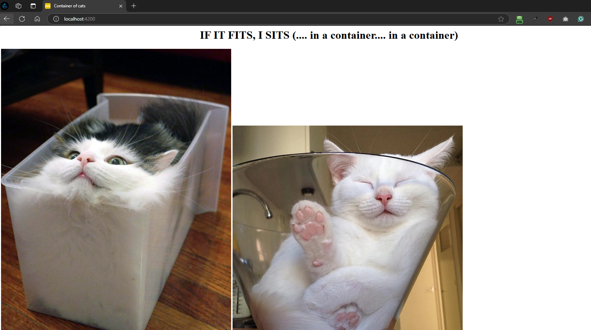

Let's now put everything that we have learned so far to use.

In the current folder, you will find a sub-folder named "build-a-simple-containerized-application". Inside that folder, we have two sub-folders for two different applications. One is named "app1-2048" and the other is named "app2-containerofcats".

First, we are going to create a Docker image for the "app1-2048" application. 

Inside the "app1-2048", we have the "2048" folder which has all the application code. And then, we have the Dockerfile as well.

Our Dockerfile is like this -

    FROM nginx:latest

    LABEL maintainer="ranaarvind156@gmail.com" 

    COPY 2048 /usr/share/nginx/html

    EXPOSE 80

    CMD ["nginx", "-g", "daemon off;"]

In the "FROM" instruction, we are using "nginx" as the base image. Nginx is commonly used as a base image for Docker containers hosting simple web applications because it’s a highly efficient, lightweight, and reliable web server.

In the "LABEL" instruction, we are setting the metadata. So, we are simply setting the "maintainer" details.

In the next line, we have the "COPY" instruction which copies the content of the "2048" folder to the "/usr/share/nginx/html" folder in the container.

In the next line, we have the "EXPOSE" instruction that tells us which PORT the application uses. Typically, we expose the port "80" because it is teh default port for HTTP traffic. When users access a website without specifying a port (e.g., http://example.com), their request is automatically directed to port 80.

Finally, we have "CMD" command which is used to specify what command to run as soon as the container starts. In our case, we are running the "nginx" command with some variables. So, our command is like this -

    nginx -g 'daemon off;'

This is used to run "Nginx" in the foreground, which is especially important when running "Nginx" within a Docker container.

Normally, Nginx is designed to run as a daemon by default, meaning it will start as a background process (in "detached" mode). However, in Docker, we usually want Nginx to run in the foreground.

Docker containers expect the main application process to run in the foreground. Docker monitors this process, and if it exits, Docker stops the container.

Running nginx in the background (its default mode) would cause the container to immediately exit because Docker would think there’s no running process to keep the container alive.

# BUILDING A DOCKER IMAGE

Now that we have our "Dockerfile", let's build a "Docker Image" from it. For that, we will use "docker build" command. Make sure the "Docker Desktop" is running because as we know, it will also run the "Docker Engine". And only if "Docker Engine" is running, we will be able to run the "docker" commands.

    docker build -t dockerized-2048 .

Let's understand the above command.

Here, "-t" flag is used to give a name to this image. Here, we are calling it "dockerized-2048". 

At the end, we have this dot "." but why? This sets the "build context". In Docker, the build context refers to the directory you specify as the root for all the files that the Docker engine might need to build an image. When you specify the build context in the docker build command, Docker sends the contents of this directory (and its subdirectories) to the Docker daemon. 

Dot (.) represents the current directory because in our case, the "Dockerfile" is present in the folder which also has the "2048" folder.

If all goes well, your image will be created and you can verify that using "docker images" command or directly checking it in the "Docker Desktop" app.

## WHAT IF Dockerfile WAS IN A SUBFOLDER?

What if, instead of Dockerfile and "2048" folder both in the same parent folder, we had a folder structure like this - 

    app1-2048
        2048
        DockerFile Folder
            Dockerfile

What if we are inside the "DockerFile Folder" and our terminal points to this location. How will we run "docker build" in this case?

If we try to do -

    docker build -t dockerized-2048 .

This will fail. Why? Because note that we are inside "DockerFile Folder". And our "build context" is set to a dot (.) which means the current folder itself. But, our current folder (DockerFile Folder) does not have the "2048" folder which we want to copy to our image. And that's why, it will definitely show you an error for the "COPY" instruction.

Okay so.. what if we specify the "build context" as the "app1-2048" folder? Maybe we can write -

    docker build -t dockerized-2048 ../

Now, what would happen? Well, this time, it again fails but for a different reason. This time, even though the "build context" is right, Docker won't be able to find a "Dockerfile". Why?

Remember that Docker would expect the "Dockerfile" to be in the "build context directory" you specified (in this case, the parent directory, ../), not in the "Dockerfile Folder."

So, you have to specifically tell Docker in which sub-folder the "Dockerfile" is present. And we do that using "-f" flag.

When the -f flag is omitted, Docker searches for a Dockerfile in the root of the build context by default. Since you specified ../ as the build context and there’s no Dockerfile directly inside ../, Docker couldn’t find it, and the build failed. Using the -f flag allows you to specify the exact location of the Dockerfile, which is especially useful when it’s outside the build context directory.

    docker build -f Dockerfile -t dockerized-2048 ../

Since we are already inside the "Dockerfile Folder" in our terminal, we can simply use "-f" and tell Docker the name of the file in this folder that it should use.

Now, what if our terminal was pointing to the "app1-2048" folder instead? In that case, this would be the command -

    docker build -f "Dockerfile Folder/Dockerfile" -t dockerized-2048 .

Note that this time, we do not need to add "../" at the end because our build context is already pointing to the current folder which contains "2048" folder. But, since this current folder doesn't directly has "Dockerfile", we have to provide the exact path in "-f" flag.

# RUNNING A CONTAINER FROM THE IMAGE

Now that we have our image created, let's run a new container from this image. We can do that using "docker run" command.

Before that, just to see the use of "LABEL" instruction, try to run "docker inspect dockerized-2048". You will see a long JSON text in the terminal. In it, go to "Config" and inside that, we have a "Labels" entry. And there, you will find this -

    "Labels": {
        "maintainer": "ranaarvind156@gmail.com"
    },

Remember that this is the data we entered in the image using "LABEL" instruction.

Coming back to running a container, we also need to map a port on our system to the port 80 on the container. That's because we want to access this web application from outside the container.

So, we can write -

    docker run -d -p 4200:80 dockerized-2048

Here, "-p" flag will map the port "4200" of our system to the port "80" of the container.

The "-d" flag will run this container in detached mode so even if we stop the terminal or close it, the container will keep running.

And now, you can visit "localhost:4200" to see the web application in your browser.

You can see this running container's details using "docker ps" command. And to see the "port" details, you can run "docker port <containerid>". In our case, it will output - 

    80/tcp -> 0.0.0.0:4200

And that's how we can build an image from a "Dockerfile" and run a container from this image. Now, let's also stop this container using -

    docker stop <containerid>

And you can also remove this container from your Docker Host using - 

    docker rm <containerid>

# BUILDING ANOTHER IMAGE

Now, let's try to build an image for the other application that we have in the folder "app2-containerofcats". This is how the "Dockerfile" looks like -

    FROM redhat/ubi8

    LABEL maintainer="Animals4life"

    RUN yum -y install httpd

    COPY index.html /var/www/html/

    COPY containerandcat*.jpg /var/www/html/

    ENTRYPOINT ["/usr/sbin/httpd", "-D", "FOREGROUND"]

    EXPOSE 80

It has some extra instructions as compared to the previous Dockerfile. This is so to make it less efficient than the previous Dockerfile.

As we can see, it uses "redhat/ubi8" as the base image. You should use the redhat/ubi8 (Universal Base Image 8) as the base image when you need a stable, enterprise-grade Linux environment that aligns with Red Hat's ecosystem but without the need for a Red Hat subscription.

In our case, we don't need anything as such but still we are using it and it is larger in size than something like "nginx" or "alpine". We also have to install a web server manually and that's why we have the "RUN" command that installs the "httpd". "Apache HTTPD" is an HTTP server daemon produced by the Apache Foundation.

Then, we also have two "COPY" commands, one that copies the index.html file to the container and the other that copies all the images that start with "containerandcat" into the container. Since we have two "COPY" instructions, it means there will be two additional layers.

So far, we have four layers. One from "FROM" instruction, one from "RUN" instruction, and two from the two "COPY" instructions.

Finally, we just have an "ENTRYPOINT" instruction so we execute a command on container start and finally we tell that the container listens on port 80.

So, let's build an image from this Dockerfile. So, we will run -

    docker build -t dockerized-containerofcats .

You will notice that this one will take more time to create an image than the previous example. And this all comes down to how you create your Dockerfile because your Dockerfile can define how efficient your image will be.

Now, let's try to update this "Dockerfile" properly. Let's use a base image such as "Nginx" which is not only lightweight but it also means we do not have to install a web server manually.

    FROM nginx:latest

    LABEL maintainer="Animals4life"

    COPY index.html /usr/share/nginx/html

    COPY containerandcat*.jpg /usr/share/nginx/html

    CMD ["nginx", "-g", "daemon off;"]

    EXPOSE 80

Now when you build an image, you will notice that it will be nmuch quicker than before. 

Moreover, the image size is also smaller if you check in the Docker Desktop or using "docker images" command.

Now, just like before, let's run a new container. We can do that using "docker run" command - 

    docker run -d -p 4200:80 dockerized-containerofcats

And now, we can visit "localhost:4200" and see the application in the browser.

So, this is how we can use "Dockerfile" to build an image and to run containers. We also saw how we have to be careful while creating Dockerfiles because each decision matters for the efficiency of a Dockerfile.

