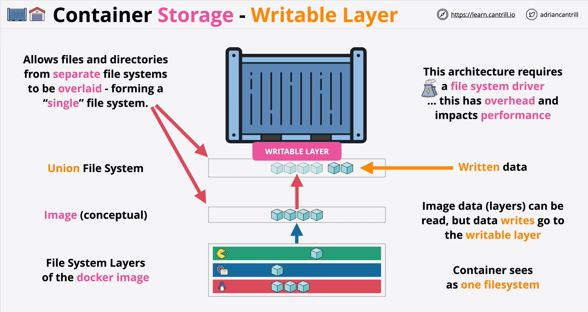
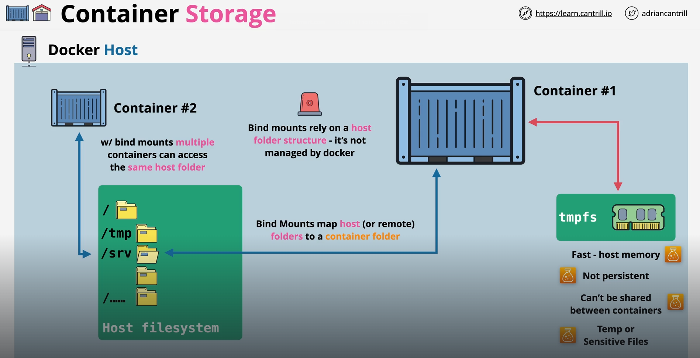
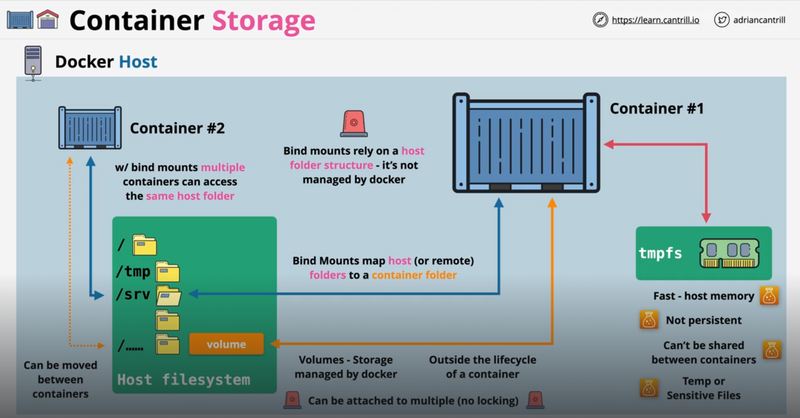

Docker storage plays a crucial role in managing data used by Docker containers. Docker provides several storage options to persist data, either within containers or outside of them.

# WRITABLE LAYER

The first type of storage available within a container is something called a "Writable Layer".

The writable layer is a temporary, container-specific layer that sits on top of the image’s read-only layers, forming the final file system view that a container can interact with. 

Each container gets its own writable layer where data specific to that container is stored. This layer is a core part of Docker’s "Union File System" but behaves differently from other storage options, as it exists only as long as the container does. 

The "Union File System" allows files and directories from "separate" file systems to be "overlaid" - forming a "single" file system". Now, this architecture requires a "file system driver" and this has overheap and impacts performance.

This layer is ideal for data that only needs to exist for the lifetime of the container, like temporary files or logs.

Any new files created, modifications to existing files, or deletions by the container occur in this writable layer.

The writable layer has some performance limitations because changes are only applied to this layer.

So, the important thing to note is that the "Image layers" can be read, but the data "writes" go to the "Writable Layer". The container, however, sees both these as one single file system, thanks to the "Union File System".

# TMPFS

TMFS stands for "Temporary File System". This type of storage resides entirely in the memory or RAM than the disk. When the container stops or restarts, this temporary storage is lost so it is ideal for the data that only needs to exist as long as the container is running and does not need to persist.

Since it uses the RAM and does not use the host's disk storage, it avoids the latency and potential wear on the disk that might come with high I/O operations.

Docker allows you to specify the size of the tmpfs mount, so you can control how much memory is allocated to it.

To use TMFPS in Docker, we can use the "--tmfps" flag when we run the "docker run" command. We have to specify the mount path within the container when we use this flag.

For example -

    docker run --tmpfs /app/tmp:rw,size=64M my_image

Here, 

    '--tmpfs /app/tmp' will create a tmpfs mount at /app/tmp in the container

    'rw' Sets the mount as read-write(Default)

    'size=64M' will limit the tmpfs mount to 64MP of memory (optional)

# BIND MOUNTS

A bind mount in Docker is a type of storage that allows you to mount a specific file or directory from the host system into a container at a designated path. Bind mounts directly expose the host’s filesystem to the container, which can be useful when you need the container to have access to specific files or directories on the host.

We can specify the exact path on the host where the data is located, and Docker mounts it directly to a path in the container. This allows us to work with existing files or directories on the host system.

This also means that unlike Writable Layer and TMPFS, the data in a bind moun remains on the host even if the container stops or is removed, making it a suitable choice for persistent storage.

This is useful for scenarios like development, where you want changes on the host filesystem to reflect immediately in the container.

Moreover, with bind mounts, multiple containers can access the same host file system so data can be shared between containers.

They are less portable than "volumes" because they depend on the specific host paths.

Since bind mounts grant direct access to the host filesystem, they can pose security risks if not managed carefully. A misconfigured container with high privileges could potentially modify host files unintentionally or maliciously.

How do we create a Bind Mount? Yet again, we will use the "docker run" command.

There are two ways. The first is using the "-v" flag.

The syntax is like this -

    docker run -v /path/on/host:/path/in/container my_image

For example, let's say we want to make "/home/user/data" on the host available inside the container at "/app/data". So, we can write -

    docker run -v /home/user/data:/app/data my_image

The second way is using the "--mount" flag and this one is generally recommended for its clarity.

    docker run --mount type=bind,source=/home/user/data,target=/app/data my_image

So, this command is more clear because we can easily figure out what is the source folder and what is the destination folder and what type of mount is it.

# VOLUMES

In Docker, volumes are a type of storage designed to persist data outside of a container's lifecycle, managed by Docker. 

Unlike the writable layer, which is temporary and removed when the container is deleted, volumes provide a dedicated location on the host that remains even if the container is removed. Volumes are generally recommended for storing persistent data across container restarts and sharing data between multiple containers.

Since "volumes" are managed by "Docker", it means no matter the host, Docker will store them at a special location at the host, usually under "/var/lib/docker/volumes/".

Volumes are isolated from the host’s regular filesystem, providing a more secure and Docker-specific storage option.

Docker manages this storage, making it more portable and less dependent on the host environment.

Volumes can be shared among multiple containers, allowing different containers to access and use the same data. This is useful for microservices architectures or applications where several containers need access to the same data.

While they can be attached to multiple containers, there is no file locking so you need to be careful when multiple containers are trying to access the same file.

To use volumes, we have to first create one. And here, we will use a command we have not yet used. It is the "docker volume" command.

We simply create a new volume by giving it a new name using this command like this -

    docker volume create my_volume

And now, we have to "attach" this volume to one or more containers and we do that using the "docker run" command again.

Just like the Bind Mount, we can either use the "-v" flag or "--mount" flag.

Using the "-v" flag, we will say -

    docker run -v my_volume:/path/in/container my_image

And Using the "--mount" flag, we will say -

    docker run --mount source=my_volume,target=/path/in/container my_image

The "--mount" option provides more control and clarity for defining the volumes.

Just like "containers", docker provides commands for managing the volumes. For example, if yo uwant to see all the volumes, just run -

    docker volume ls

If you want to inspect a volume, just run -

    docker volume inspect my_volume

If you want to remove a volume, just run -

    docker volume rm my_volume

# VOLUMES VS BIND MOUNTS

Both volumes and bind mounts are powerful, but volumes are generally preferred for their portability, ease of management, and integration with Docker’s ecosystem, especially in production environments. Bind mounts are more suitable for development needs or accessing specific host files directly.

Here are the key differences -

1. **Storage Location** - In case of "Volumes", the storage location is "Docker-managed". On the other hand, the storage location is "User-defined" in case of "Bind Mounts".
   
2. **Data Persistence** - The data is persistent in case of both but in case of "Bind Mounts", the data persistence relies on the specific host path existing. If that host path does not exist, the data is also not accessible in the container.
   
3. **Portability** - "Bind Mounts" are not easily portable as they are specific to the host's filesystem. On the other hand, the "Volumes" are portables across different environments so they are independent of the host's filesystem.

4. **Ease of Management** - Since "Volumes" are managed by Docker itself, it is quite simply to create, share and remove them. On the other hand, the "Bind Mounts" are crated by the user so user has to manage them manually.

5. **Security** - "Volumes" are isolated from the host file system, reducing the risk of host file corruption. But, the "Bind Mounts" have a direct access to the host filesystem, that may pose security risks.

6. **Performance** - "Volumes" are optimized by Docker for use with containers. The "Bind Mounts" are slightly faster than "Volumes" as they have a direct access to the host filesystem.

7. **Sharing Across Containers** - "Volumes" make it easy to share data among multiple containers. While the "Bind Mounts" are also shareable, the path must be accessible to each container.

8. **Backup and Restore** - Docker provides native tools to back and restore volumes. On the other hands, the backups must be managed directly from host filesystem in case of "Bind Mounts".

9. **Use Cases** - "Volumes" are ideal for persistent data like databases, user data, logs and so on. On the other hand, the "Bind Mounts" are useful for development (e.g. code sharing) or accessing host data.
