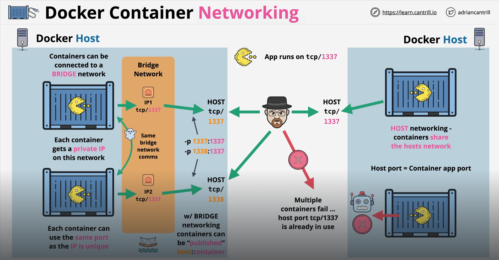

Docker networking enables communication between Docker containers, the host machine, and external networks.

There are several networking modes that Docker offers for containers to communicate with each other and the external world. The two basic ones are -

    1. Host Networking
    2. Bridge Networking

# HOST NETWORKING MODE

As the name suggests, in this mode, Docker allows a container to directly share the host's network stack. So, the container does not get its own network namespace but instead it uses the host's networking namespace. this means, the container effectively behaves as if it is running directly on the host.

For example, if the host IP is "192.168.1.100" then the container will also use this same IP.

The container can also directly use the same network interfaces and ports as the host without NAT (Network Address Translation).

In this case, post mapping using "-p" flag are ignored because the container is already bound to the host's network.

Since there's no network abstraction (like a virtual network), communication is faster, making it ideal for performance-critical applications.

If there are any services running on the host, such as DNS or Database, then the container can directly access them.

Use cases of Host Networking include High-performance Application that require very low network latency or high bandwith (e.g. gaming servers, media streaming etc), networking tools like packet sniffers or monitoring tools that need access to the host's network stack, etc.

We can use "--network" flag to use the "Host Networking Mode" -

    docker run --network=host my-container

## THE DISTADVANTAGES

The biggest disadvantage is "Port Conflict". If a service on the host is already using a port, the container cannot use that same port. 

Moreover, let's say a container is listening on port "1337" and using Host Networking. We cannot run another container with the same image on the same host because the port "1337" will be already in use. And as we understood, we will not be able to use "-p" flag as well to map this second container to a different port.

So, if we want to run multiple "same" containers, then the "Host Networking" might not be the best option.

Since there is no isolation, there is a risk of unintended access to host's network.

Host networking is specific to the environment, making the setup less portable.

# BRIDGE NETWORKING MODE

The problem of port conflict in "Host Networking" is solved using "Bridge Networking". This is also the "default" mode for standalone containers in Docker. This will create an isolated private network on the Docker Host, enabling communication between containers and the host system.

To expose a container's services to the host or external systems, we need to map the container ports to host ports using "-p" flag.

Docker creates a virtual "Ethernet Bridge" on the host called "docker0". When you start a container, a it gets a virtual network interface and a private IP address in the bridge network's subnet.

In this way, it does not matter if you are running multiple same containers and each container can use the same port, since the IP of each is still unique and not the same as the Host IP.

In this mode, multiple containers can communicate with each other directly since they are on the same Bridge Network. But, they cannot be reached from outside unless we "publish" them.

Publishing a container in Docker refers to making the container's internal services accessible outside the container, either to the host machine or to external systems. This is typically achieved by mapping ports from the container to the host machine using the "-p" or "--publish" option.

    docker run -p <host_port>:<container_port> <image>

The use cases of Bridge Networking include Standalone Applications that do not need to communicate with containers outside the bridge network, and for development and testing.

## DISADVANTAGES

Containers on a bridge network cannot communicate with containers on another host unless configured explicitly.

Bridge Networking requires explicit port mappings to expose container services to external networks.
