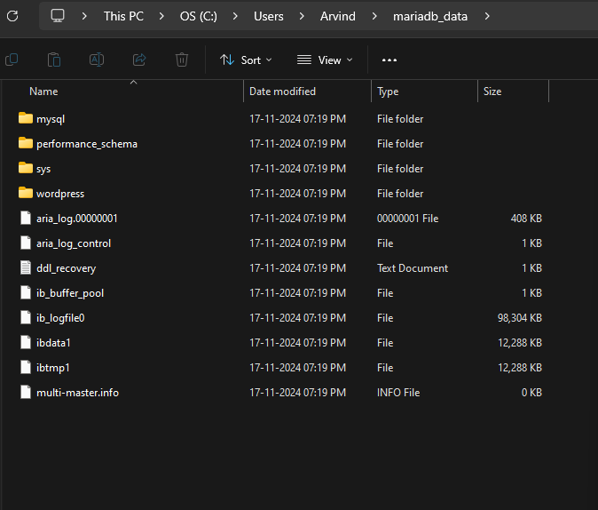
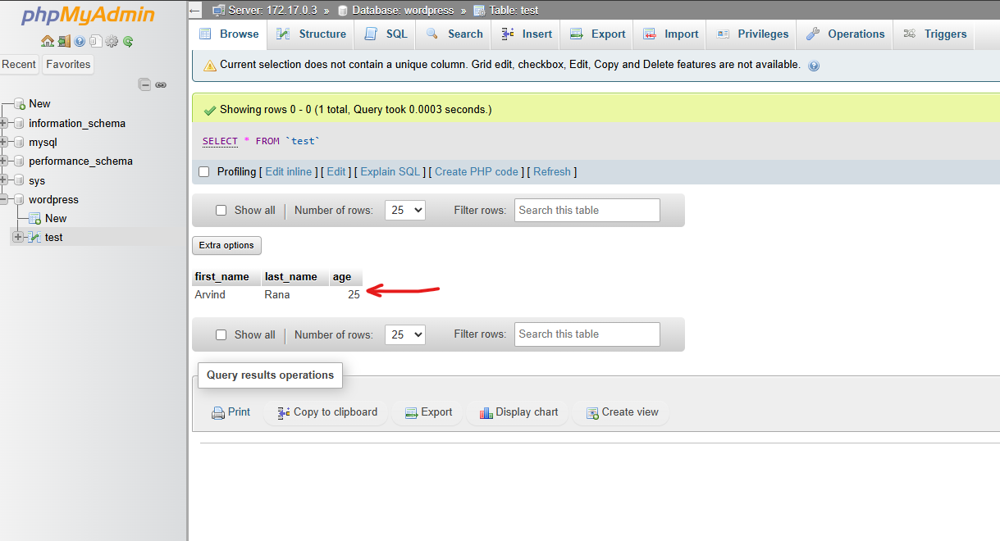

In the last section, we saw how we can use "Environment Variables" in Docker Containers. We also saw an example where we had a container running phpMyAdmin and another one with MariaDB Database Engine. 

But, we came across one issue with data persistence because so far, our containers use the "Writeable Layer" for data which means if the containers are deleted, the data gets deleted as well. This is not ideal for things like databases because we want the data to be persisted.

In the Docker Storage section, we learnt about various ways in which we can deal with data in the container. Two of those ways included "Bind Mounts" and "Volumes".

So, let's do some hands on practice now.

First, like before, we will spin up our "phpMyAdmin" container using the following command -

    docker run --name phpmyadmin -d -p 8081:80 -e PMA_ARBITRARY=1 phpmyadmin/phpmyadmin

# BIND MOUNTS

Bind mounts in Docker allow you to map a directory or file from the host system to a container. This means changes made to the directory or file on the host will immediately reflect in the container and vice versa. It’s commonly used for local development to share code or data between the host and the container.

Changes made in the bind-mounted directory are persistent and survive container restarts since they are stored on the host system.

So, let's create a Bind Mount for the mariaDB container. As we know, we can either use the "-v" flag or the "--mount" flag. The "--mount" flag is recommended as it makes the command more readable.

First, let's create a new folder named "mariadb_data" using "mkdir" command - 

    mkdir mariadb_data

I've created it in "C -> Users -> Username" folder but it depends on you where you want to make it.

Now, we want to map this folder to the "/var/lib/mysql" folder on the mariaDB Container. So, this is how it will look -

    --mount type=bind,source=C:\Users\Arvind\mariadb_data,target=/var/lib/mysql

So, when we run "docker run" command to run the "mariaDB" container, this flag is what we need to include as well. So, the entire command looks like this -

    docker run --name db -e MYSQL_ROOT_PASSWORD=somewordpress -e MYSQL_PASSWORD=wordpress -e MYSQL_DATABASE=wordpress -e MYSQL_USER=wordpress --mount type=bind,source=C:\Users\Arvind\mariadb_data,target=/var/lib/mysql -d mariadb:10.6.4-focal --default-authentication-plugin=mysql_native_password

If everything is right, then the container will start and yet again, you can use "docker inspect container_id" to see the IP address and then login to the database using phpMyAdmin at "localhost:8081" with the root user.

And now, if you go to the host folder that you mapped (C -> Users -> Username in my case), then you will see all the files related to mariaDB in that folder.

So now, any changes in the container will reflect in this folder and vice versa.

And that's how we can add "Bind Mounts".

# VOLUMES

"Volumes" are the preferred way to add storage to the containers outside the lifecycle of the containers.

Docker volumes are used to manage data persistence and decouple the container's filesystem from the host machine. Unlike bind mounts, volumes are fully managed by Docker and are stored in a Docker-controlled location on the host system.

So, instead of mapping a folder on the host to the folder on the container, we simply create a "volume" and attach it to the container. It is up to docker to manage that volume and the data in it.

To create a new volume, we use the "docker volume create" command like this -

    docker volume create mariadb_data

This will create a new volume named "mariadb_data". To see all the volumes, you can run "docker volume ls" command.

Now, when we run the mariaDB container, we need to attach this volume to that container. Note that even if we do not have a volume with a specified name, it will be created first by docker and then get attached to the container.

So, let's see the command to attach this volume to the container. It is pretty simple -

    docker run --name db -e MYSQL_ROOT_PASSWORD=somewordpress -e MYSQL_PASSWORD=wordpress -e MYSQL_DATABASE=wordpress -e MYSQL_USER=wordpress --mount source=mariadb_data,target=/var/lib/mysql -d mariadb:10.6.4-focal --default-authentication-plugin=mysql_native_password

To see data persistence in action, let's create a new table under the "wordpress" folder. And let's just add some data to it.

So, I've added one row to this table.

Now, let's stop the container and delete the container.

If we were not using Volumes or Bind Mounts, then, when we restart this container, all the data would be lost.

But, let's see what happens in this case.

To stop the container, we can write -

    docker stop db

And to remove it, we write -

    docker rm db

Now, let's run the mariaDB containe once again using -

    docker run --name db -e MYSQL_ROOT_PASSWORD=somewordpress -e MYSQL_PASSWORD=wordpress -e MYSQL_DATABASE=wordpress -e MYSQL_USER=wordpress --mount source=mariadb_data,target=/var/lib/mysql -d mariadb:10.6.4-focal --default-authentication-plugin=mysql_native_password

Now, when you login to the phpMyAdmin dashboard, you will see the "test" table still exists under "wordpress" and so does the one row we adde to this table. So, our data is being persisted.

And that's how we use Bind Mounts and Volumes in Docker.