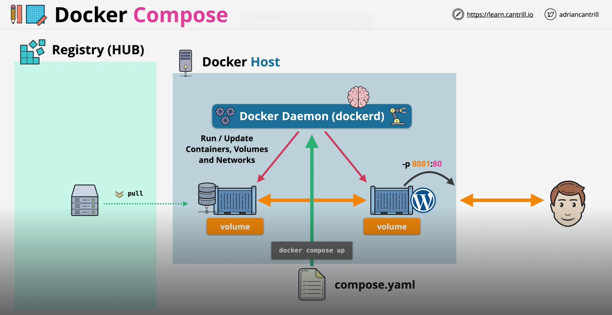

In simplest words, "Docker Compose" is a tool used to "Create", "Manage" and "Cleanup" multi-container applications.

So, if we have an application with multiple containers, then we can use "Docker Compose" to manage those containers efficiently.

"Compose" simplifies the control of your entire application stack, making it easy to manage services, networks, and volumes in a single, comprehensible YAML configuration file. Then, with a single command, you create and start all the services from your configuration file.

The way "Docker Compose" works is by reading the configuration from a file called the "docker compose file". This is generally named "compose.yaml" (or compose.yml) and it has the rules that define multi-container applications.

In previous versions of "Docker", this file was named "docker-compose.yaml" or "docker-compose.yml" and it is still supported in the newer versions for backwards compatibility. In case both exist, then Docker will prefer the "compose.yaml" file over the "docker-compose.yaml" file.

In a "compose.yaml" file, we define what all services should run and to start all of them, we use the "docker compose up" command. Similarly, to stop and remove the running services, we run "docker compose down" command.

# EXAMPLE

Consider an application split into a "frontend web application" and a "backend service".

The frontend is configured at runtime with an HTTP configuration file managed by infrastructure, providing an external domain name, and an HTTPS server certificate injected by the platform's secured secret store.

The backend stores data in a persistent volume.

Both services communicate with each other on an isolated back-tier network, while the frontend is also connected to a front-tier network and exposes port 443 for external usage.

So, we have the following -

    2 services, backed by Docker images: webapp and database
    1 secret (HTTPS certificate), injected into the frontend
    1 configuration (HTTP), injected into the frontend
    1 persistent volume, attached to the backend
    2 networks

So, this is how our "compose.yaml" file might look like -

    services:
        frontend:
            image: example/webapp
            ports:
            - "443:8043"
            networks:
            - front-tier
            - back-tier
            configs:
            - httpd-config
            secrets:
            - server-certificate

        backend:
            image: example/database
            volumes:
            - db-data:/etc/data
            networks:
            - back-tier

    volumes:
        db-data:
            driver: flocker
            driver_opts:
            size: "10GiB"

    configs:
        httpd-config:
            external: true

    secrets:
        server-certificate:
            external: true

    networks:
        # The presence of these objects is sufficient to define them
        front-tier: {}
        back-tier: {}

Now, if we run the "docker compose up" command, it will start the frontend and backend services, create the necessary networks and volumes, and injects the configuration and secret into the frontend service.

To get a snapshot of all the running services, we have the "docker compose ps" command.
