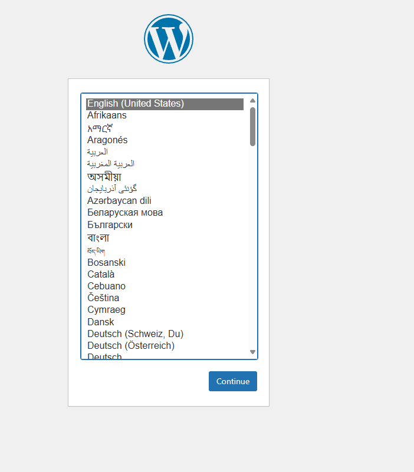
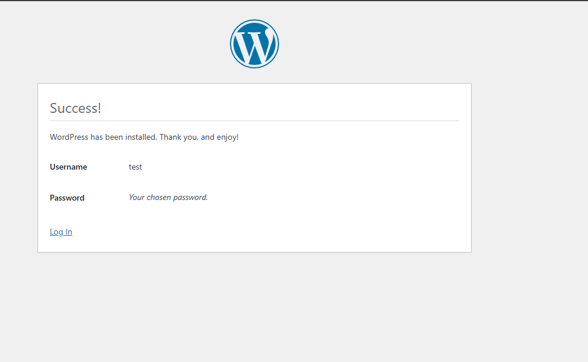
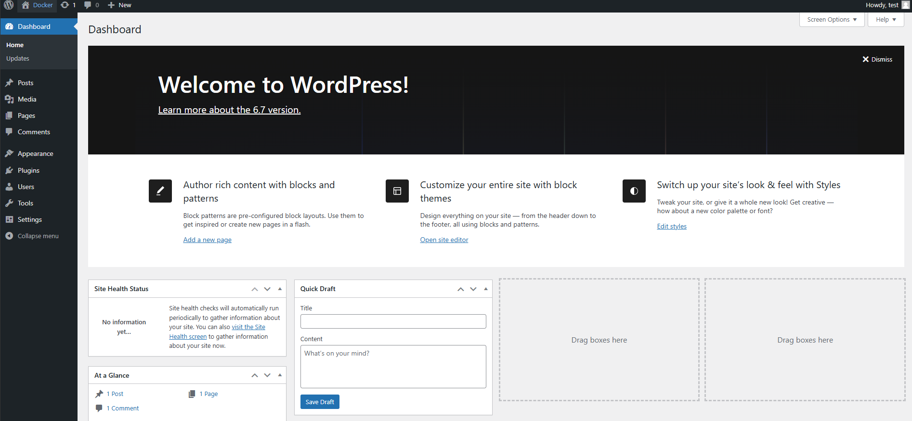
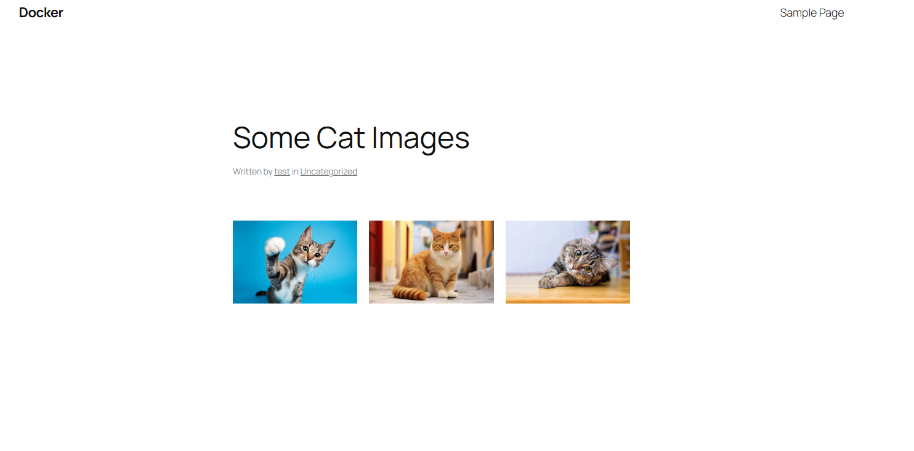

In the current folder, you will find one "compose.yml" file which is a "Docker Compose" file.

And in this file, we have the configuration for a  multi-container application. The application has a "MariaDB" container and also a "Wordpress" container.

In any Docker Compose file, we define the containers that make up the application using "services" property. In our case, we have something like this - 

    services:
        db:
        wordpress:

This means, we have two "containers" named as "db" and "wordpress".

Now, for individual containers, we have to define their configuration. First, we have the "db" container which is going to use the "MariaDB" image. So, it looks like this -

    db:
        image: mariadb:10.6.4-focal
        command: '--default-authentication-plugin=mysql_native_password'
        volumes:
            - mariadb_data:/var/lib/mysql
        restart: always
        environment:
            - MYSQL_ROOT_PASSWORD=somewordpress
            - MYSQL_DATABASE=wordpress
            - MYSQL_USER=wordpress
            - MYSQL_PASSWORD=wordpress
        expose:
            - 3306
            - 33060

Here, first, we define what image this container will use using the "image" property. So, we are using "mariadb:10.6.4-focal" image.

Then, we use the "command" property which defines the command that will run when the container starts. In our case, we are telling the MariaDB container to run with the option "--default-authentication-plugin=mysql_native_password".

Next up, we have "volumes" property which defines the mapping of a named valume "mariadb_data" to the "/var/lib/mysql" folder in the container.

The "restart" property is set to "always" which ensures a container restarted if it stops. If it's manually stopped, it's restarted only when Docker daemon restarts or the container itself is manually restarted.

The "environment" propert sets the environment variables for MariaDB which we already know.

And finally, the "expose" property makes the ports "3306" (default MySQL port) and "33060" available for inter-container communication. Note that these ports are not exposed to the host machine.

We are doing a similar thing for "wordpress" container - 

    wordpress:
        image: wordpress:latest
        volumes:
            - wordpress_data:/var/www/html
        ports:
          - 8081:80
        restart: always
        environment:
          - WORDPRESS_DB_HOST=db
          - WORDPRESS_DB_USER=wordpress
          - WORDPRESS_DB_PASSWORD=wordpress
          - WORDPRESS_DB_NAME=wordpress

So, here too, we first define the "image" that this container is going to use which in our case is "wordpress:latest". Then, we define the mapping of named volume "wordpress_data" to the "/var/www/html" folder in the container.

Then, we define the mapping of the host port and the container port using "ports" property. Here, the port "8081" of the host is mapped to port "80" in the container. In this way, we can access the application from "localhost:8081" on our system.

The "restart" property is set to "always" which ensures a container restarted if it stops. If it's manually stopped, it's restarted only when Docker daemon restarts or the container itself is manually restarted.

Finally, we have the environment variables for the "wordpress" container.

Lastly, we have this in our compose file - 

    volumes:
        mariadb_data:
        wordpress_data:

This simply defines what all "volumes" our application is going to use. If we just mention their names like above, Docker will go ahead and create new volumes with the same name if they do not exist. If you want, you can configure them further.

And well, that's our simple Docker Compose file. Ofcourse this is just a simple application but you can imagine how useful this is for a big application with multiple containers. We can simply spin up all the containers just by using this compose file instead of worrying about running individual containers one my one manually with all the necessary configurations.

# RUNNING THE CONTAINERS

Now, let's see how we can run all the containers using this file.

For this, open a terminal in the folder where you have this file. Then, we can simply run this command - 

    docker compose up -d

Note that we did not specify any name of the file. If you run this command, docker will look for a file with the default name which is "compose.yml" or "compose.yaml" or "docker_compose.yml" or "docker_compose.yaml".

This command simply says "bring up" all the things defined in the file. The "-d" flag simply runs this in detached mode so if we stop or exit the terminal, it will not stop the process of docker compose.

Once you run this command, it will first "pull" the images for the containers from the repository and download all the file system layers for those images.

Then, it will create two named volumes. It will most likely put the name of the folder in which you have Docker Compose file in the beginning of the container and volume names as that's its default behavior.

If you want to define your own prefix, you can use "-p" flag like this -

    docker compose -p test up

So, in this case, "test" will be attached in front of the names so the names will be like "test_wordpress_data".

Now, if we run "docker ps" you will see two containers running. 

And you can go to "localhost:8081" which will show you the wordpress installation page.

So, we can now install wordpress by giving the required information. 

And then, you can login to wordpress using the username and password you set.

# DATA PERSISTENCE

Let's maybe add a new post just to see how data is persisted.

We will run the following command that will stop the containers and also remove them completely - 

    docker compose down

But, this won't remove the volumes. So, if we again run the "docker compose up" command and that creates new containers, the volumes will be reused which means the data is restored. So, let's see that. Let's run the following command again - 

    docker compose up -d

Now, if you go to "http://localhost:8081/", it will show you the post you had published previously with all the images and other stuff you added to it. This means, our data is not lost even though we removed the containers.