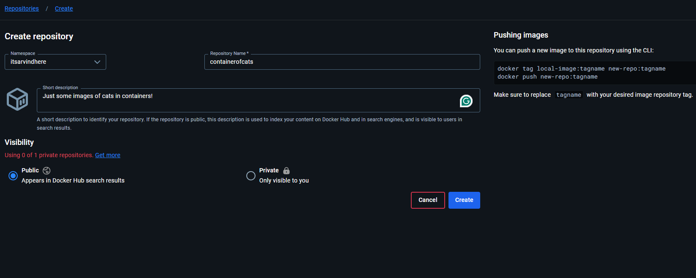
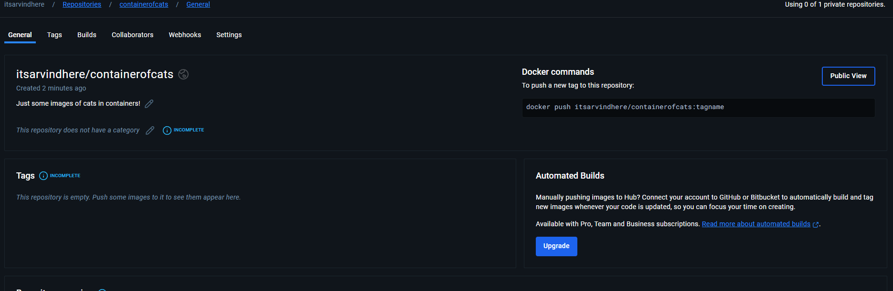
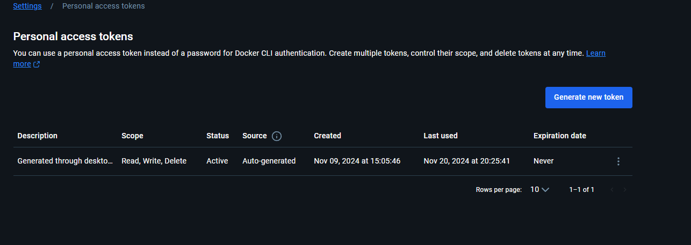
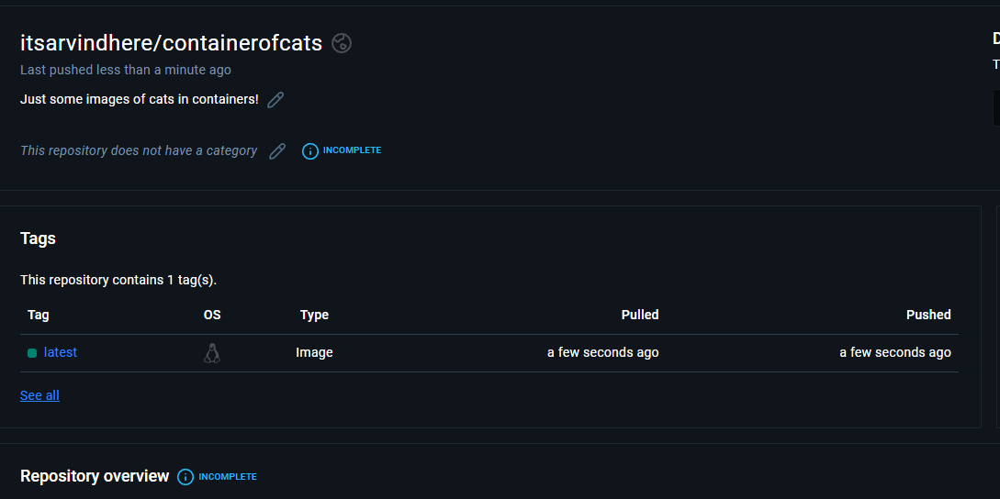

Let's have some practical experience now with Docker Hub. 

First, make sure you have an account in Docker Hub. If you don't, then just go to https://app.docker.com/signup to signup. Once you are signed in, make sure you note your username because that will be used in various commands that we will use.

First, let's pull an existing image using the following command - 

    docker pull acantril/containerofcats:latest

This command can pull any docker image that is public on Docker Hub. So, when we run the command, it will download the image and all the file system layers.

Now, let's create a new "Repository" in Docker Hub using the "Create" button that you can find in "Repositories" page.

You can have a name that is same as someone else's repository, but just make sure it is not same as some of your other repository. 

Once you have filled in all the details, just hit Create and this will create a new repository. And now, to this, we can "push" an image.

If you have Docker Desktop installed, you can log in to that using the same account you created in Docker Hub. Then, if you go to Docker Hub setting and go to Security, there will be one Access Token already generated. If not, then you can generate one with "Read, Write and Delete" permission.

If you are logged in to Docker Desktop already, you just need to run "docker login" and this will use your existing credentials and log you in.

Otherwise, you can run -

    docker login --username=YOUR_USER

If asked for password, you can provide the Access Token as well.

In the current folder, there is a folder named "app2-containerofcats" which has a Dockerfile. So, open a new terminal in that folder.

We will create a new image from this Dockerfile -

    docker built -t containerofcats .

When this command finishes, a new image will be created and stored on local Docker Host. 

It is very important to do the next step. We first have to "tag" this image with our Docker Hub username and repository name.

For that, we use the "docker tag" command - 

    docker tag <image_id> <user_name>/<repository_name>:version

So, in my case, it will be something like this -

    docker tag 39b0810a7541 itsarvindhere/containerofcats:latest

To verify that the command succeeded, you can run "docker images" and you will see a new image with same name as above command. In my case, it is "itsarvindhere/containerofcats".

Now, we can push it to Docker Hub. And for that, we can run the following command - 

    docker push <image_name_that_you_just_tagged>:version

So, in my case, it will be - 

    docker push itsarvindhere/containerofcats:latest

And we are done! This will push the image to the Docker Hub to our repository and since it is a Public repository, anyone can see it and use it if they want to.

Even we can pull it if we want to by running - 

    docker pull itsarvindhere/containerofcats:latest

But since we already have this image and its latest version, Docker does not waste any bandwidth in downloading it again.